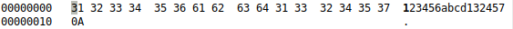

## Blowfish file encryptor

Programs are designed to encrypt/decrypt files using the Blowfish algorithm in ECB mode.

### How to start a program

```bash
make
./blowfish <key_file> <input_file> <output_file> <mode>
```
The 1st argument <key_file>: 256-bit file containing the key;

The 2nd argument <input_file>: name of the file to be encrypted/decrypted;

The 3rd argument <output_file>: name of encrypted/decrypted file;

The 4th argument <mode>: mode of program working (1 - encryption; 2 - decryption).

Program adds 1 byte to the beginning of file - a number of appended zero bytes.

### An exapmle of program working

You can generate a random key like this


Original file data:



Launching the program:


Cipher data:


Highlighted in blue: number of appended zero bytes (block padding up to 64 bits);

Highlighted in red: cipher data;

Highlighted in purple: encrypted end-of-file character;

Highlighted in green: encrypted appended zeros.


